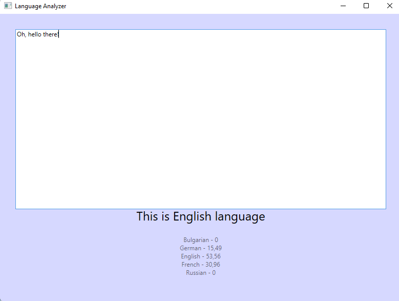
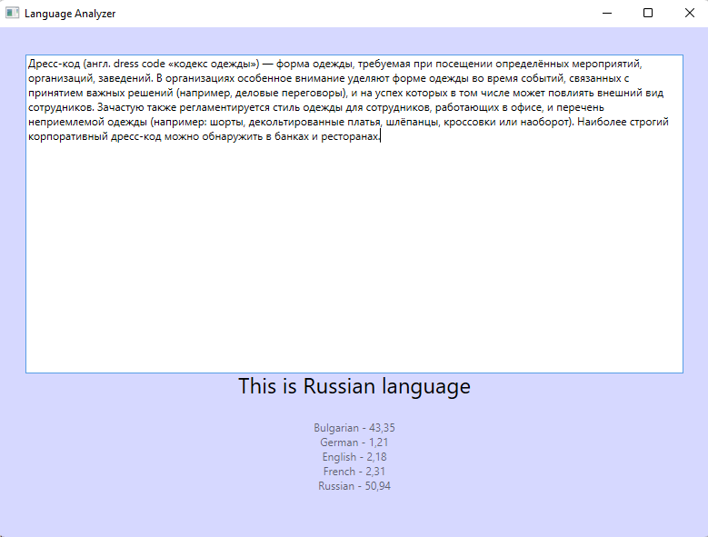
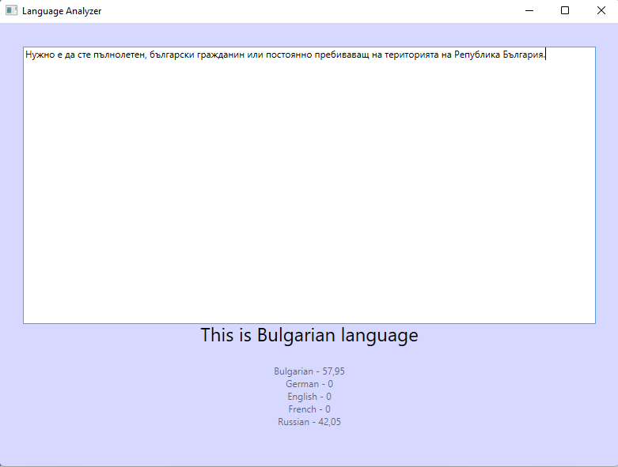
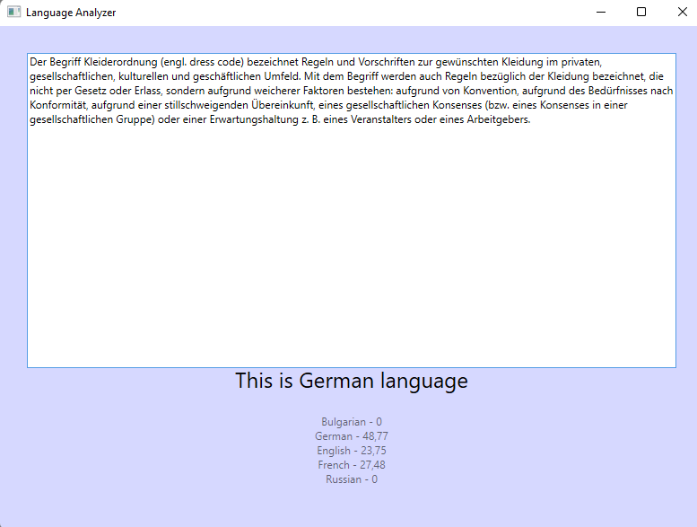
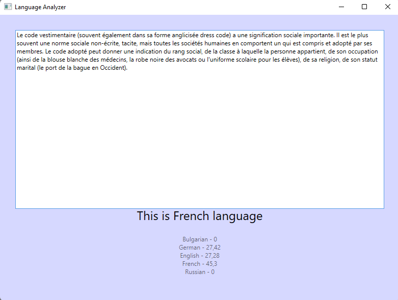

# Language-Detector

## Description

**WikipediaDataParser** is used to parse Wikipedia dump files (xml format) or plain text to generate dictionary of occurrences of different parts(ngrams). The beginning and end of words and punctuation marks are taken into account

**LanguageAnalyzeApp** is used to detect language using language dictionaries. Each language is gaining points, lanuage with with most points wins.

## Screenshots

